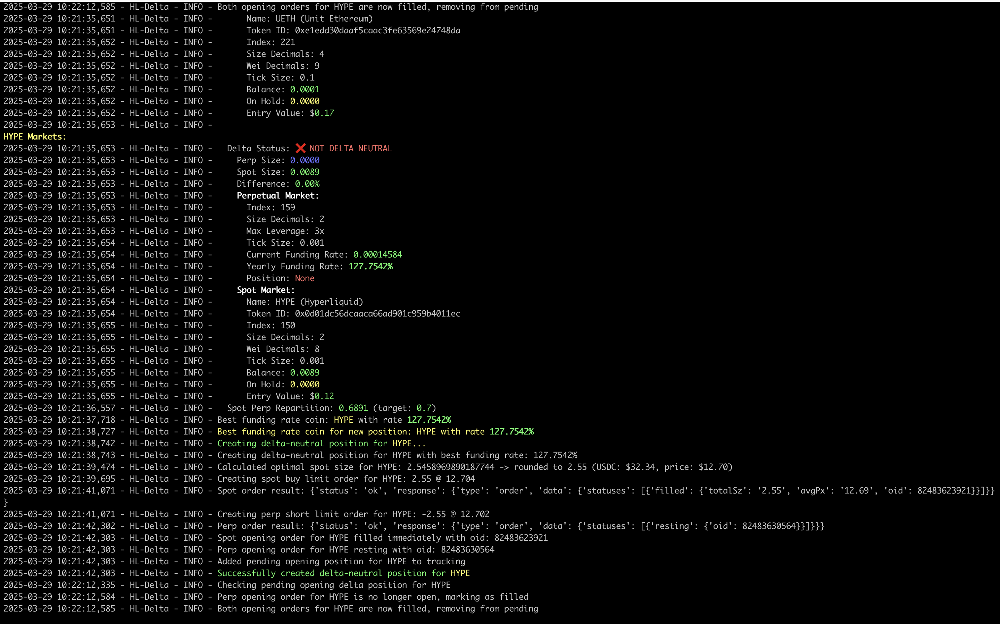
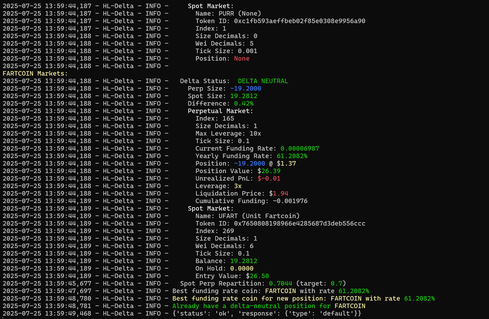

FORKED VERSION with 
* added coins (SOL, PUMP, FARTCOIN, ...), will probably add more later.
* uses wallet address instead of Vault (no need to pay 100$ to set up a Vault).
* Added leverage parameter that will change the leverage (3 by default) and put margin to Cross (**always use a dedicated account for this bot**).
* The script `show_tickers.py` shows all tickers for futures and spot, to help to code them in Delta.py (eg. for FARTCOIN, spot name is UFART and futures name is FARTCOIN; it is somewhat arbitrary so it will be hardcoded).
* Will not close the Delta neutral position when the code is interupted (ctrl+c) or closed. But will update position if necessary. **The user must close the position manually if desired**.

Additional information:
*  Use a dedicated hot wallet. Make sure Leverage is set to Cross. You may set it to 3, or a lower value depending in your `spot_pct` and `perp_pct`. Be careful.
*  in `config.json`, the BASE string of the Futures Market should be used; format of market are is BASE/USDC:USDC (use only BASE).
*  You should use a dedicated Hot Wallet. Cold wallets like ledger will not work.
*  When setting up the environment variables for the `HYPERLIQUID_ADDRESS` and `HYPERLIQUID_PRIVATE_KEY`, you must use ones from a Hot wallet (e.g. generated with Rabby, Metamask, ...). Your `HYPERLIQUID_ADDRESS` is your Ethereum wallet addrees (copy/paste from Metamask or Rabby), and `HYPERLIQUID_PRIVATE_KEY` is the secret key given by Hyperliquid when you generate a API key pair (On Hyperliquid website, section more->API).

# HyperVault Delta Bot forked v1.0.0+

A delta-neutral trading bot for HyperLiquid exchange, designed to create and manage delta-neutral positions across spot and perpetual markets.


*Delta Bot taking a position on HyperLiquid Exchange*


## Features

- Implements delta-neutral trading strategies across spot and perpetual markets
- Automatically identifies the best funding rates for optimal yield
- Monitors and rebalances positions to maintain delta neutrality
- RESTful API for remote control and monitoring
- Handles order tracking and management
- Periodic checks to find better opportunities based on funding rates
- ---Graceful shutdown with position closing---
- Comprehensive logging

## Configuration

The bot uses a combination of configuration files and environment variables:

### 1. **Configuration File** (config.json) - Primary Configuration

The preferred way to configure the bot is through the `config.json` file, which controls most of the bot's behavior:

```json
{
  "general": {
    "debug": false,
    "tracked_coins": ["BTC", "ETH", "HYPE", "SOL", "USDC", "PUMP", "PURR", "FARTCOIN"],
    "autostart": true
  },
  "allocation": {
    "spot_pct": 70,
    "perp_pct": 30,
    "rebalance_threshold": 0.05,
    "leverage": 3
  },
  "trading": {
    "refresh_interval_sec": 60
  },
  "api": {
    "host": "0.0.0.0",
    "port": 8080,
    "enabled": true
  }
} 
```

Configuration sections:
- **General settings:**
  - `debug`: Enable detailed debug logging
  - `tracked_coins`: List of coins to track and trade
  - `autostart`: Whether to start trading automatically
- **Allocation settings:**
  - `spot_pct`: Percentage of capital to allocate to spot positions (e.g., 70%)
  - `perp_pct`: Percentage of capital to allocate to perpetual positions (e.g., 30%)
  - `rebalance_threshold`: Funding APR value threshold for changing the position (e.g., 0.05 = 5% if APR funding is less that 5%, stop and try to open another, better, one on another coin)
  - `leverage` : leverage used
- **Trading settings:**
  - `refresh_interval_sec`: Interval for checking for refreshing positions in seconds
- **API settings:**
  - `host`: Host for the API server
  - `port`: Port for the API server
  - `enabled`: Whether the API server is enabled

### 2. **Environment Variables** - Required for Authentication

These environment variables are used for authentication with HyperLiquid and must be set:

- `HYPERLIQUID_PRIVATE_KEY`: Your private key for trading on HyperLiquid
- `HYPERLIQUID_ADDRESS`: Your Ethereum address for HyperLiquid

Example using environment variables:
```bash
export HYPERLIQUID_PRIVATE_KEY={PRIVATE_KEY}
export HYPERLIQUID_ADDRESS={SUB_ACCOUNT_TRADING_ADDRESS}
```

On windows, add it in the Windows dedicated setting.

## Quick Start

1. Clone the repository
2. Set up environment variables for authentication
3. Customize `config.json` to match your desired trading parameters
4. Run the example script to test your configuration:
```bash
python example.py
```
5. Start the bot:
```bash
python Delta.py
```

## Building

Build the Docker image with:

```bash
./build.sh
```

This will create two images:
- `hypervault-tradingbot:delta` (latest version)
- `hypervault-tradingbot:delta-1.0.0` (versioned tag)

## API Endpoints

The bot provides a RESTful API for remote control and monitoring:

### Bot Control
- `GET /api/bot/state`: Get the current state of the bot
- `POST /api/bot/start`: Start the bot's trading operations
- `POST /api/bot/stop`: Stop the bot's trading operations
- `POST /api/bot/close-position/{coin}`: Close a specific position
- `POST /api/bot/create-position/{coin}`: Create a position for a specific coin

### Status and Monitoring
- `GET /api/status`: Get the current status of the bot and its positions
- `GET /api/status/funding-rates`: Get the current funding rates for all tracked coins
- `GET /api/status/positions`: Get all current positions

### Configuration
- `GET /api/config`: Get the current configuration of the bot
- `POST /api/config/update`: Update the bot's configuration
- `GET /api/config/tracked-coins`: Get the list of tracked coins
- `POST /api/config/add-coin/{coin}`: Add a coin to the tracked coins list
- `POST /api/config/remove-coin/{coin}`: Remove a coin from the tracked coins list

## Usage

1. Create a `.env` file from `.env.example` with your credentials
2. Adjust `config.json` to match your desired trading parameters
3. Build and run the Docker container:

```bash
docker run -d \
  --name delta-bot \
  -p 8080:8080 \
  --env-file .env \
  hypervault-tradingbot:delta-1.0.0
```

## The HyperVault Trading Ecosystem (Coming Soon!)

The Delta bot is part of the comprehensive HyperVault trading ecosystem. Our full platform will allow you to:

- Deploy multiple bots with a single click
- Leverage our Machine Learning engine to automatically optimize your trading configurations
- Access specialized bots including this Delta-Neutral bot and our Market Making bots
- Monitor your performance through our advanced dashboard featuring:
  - Real-time position management
  - Earnings visualization and analytics
  - Latest position tracking and performance metrics

HyperVault is designed for both new traders seeking simplified automation and experienced traders demanding powerful customization.

## Delta-Neutral Strategy

The Delta bot implements a capital-efficient strategy:
- Long spot positions to earn the funding rate
- Short perpetual futures positions to hedge price risk
- Automatically switches to better opportunities when funding rates change

The system targets a 70/30 spot-to-perp allocation ratio for optimal capital efficiency.

## Versioning

### Current Version: 1.0.0

**Release Notes:**
- Initial release with core delta-neutral functionality
- Full integration with HyperVault Trading Bots platform
- API-based control and monitoring
- Automatic detection of best funding opportunities

## License

MIT License

Copyright (c) 2024

Permission is hereby granted, free of charge, to any person obtaining a copy
of this software and associated documentation files (the "Software"), to deal
in the Software without restriction, including without limitation the rights
to use, copy, modify, merge, publish, distribute, sublicense, and/or sell
copies of the Software, and to permit persons to whom the Software is
furnished to do so, subject to the following conditions:

The above copyright notice and this permission notice shall be included in all
copies or substantial portions of the Software.

THE SOFTWARE IS PROVIDED "AS IS", WITHOUT WARRANTY OF ANY KIND, EXPRESS OR
IMPLIED, INCLUDING BUT NOT LIMITED TO THE WARRANTIES OF MERCHANTABILITY,
FITNESS FOR A PARTICULAR PURPOSE AND NONINFRINGEMENT. IN NO EVENT SHALL THE
AUTHORS OR COPYRIGHT HOLDERS BE LIABLE FOR ANY CLAIM, DAMAGES OR OTHER
LIABILITY, WHETHER IN AN ACTION OF CONTRACT, TORT OR OTHERWISE, ARISING FROM,
OUT OF OR IN CONNECTION WITH THE SOFTWARE OR THE USE OR OTHER DEALINGS IN THE
SOFTWARE.

## Disclaimer

This software is for educational purposes only. Use at your own risk. Trading cryptocurrencies involves significant risk of loss and is not suitable for all investors. 
